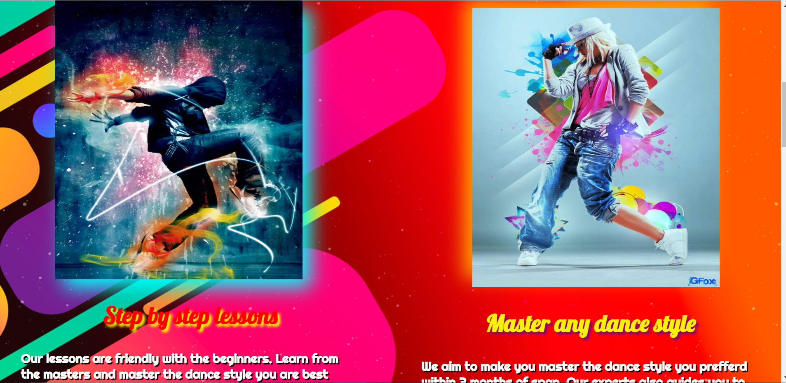
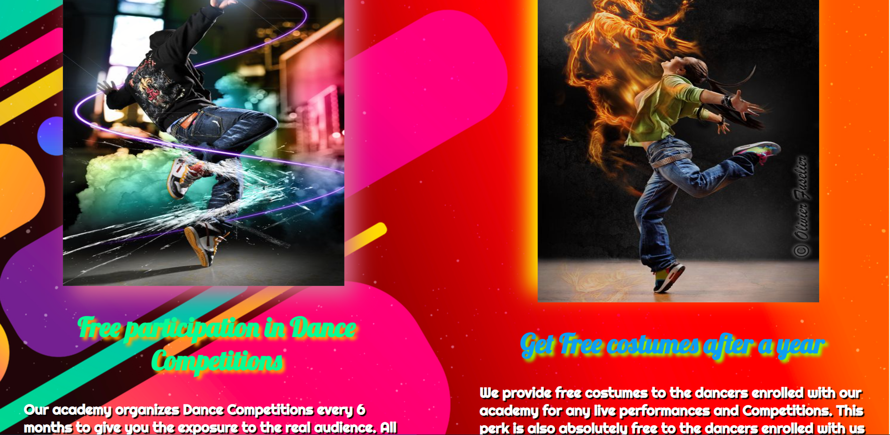

# Super Dance Academy

Super Dance Academy is website made for promotion of dance coaching centers.
It is very attractive and beutiful website with animations and styling.

## Tech Stack

**Client:** HTML, CSS , JAVASCRIPT ,PUG

**Server:** EXPRESSJS, MONGODB

## 🚀 About Me

I am a software developer.

## Authors

- [@Yash-Dabhade](https://www.github.com/Yash-Dabhade)

## Installation and Testing

To run this project , install nodejs and go to project directory.
Open cmd or any other terminal and run the following commands.

```bash
  npm i
```

```bash
  npm i nodemon
```

```bash
  nodemon App.js
```

After that open localhost.

## Screenshots







